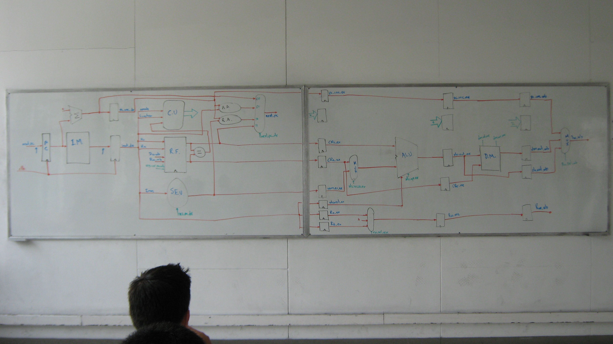
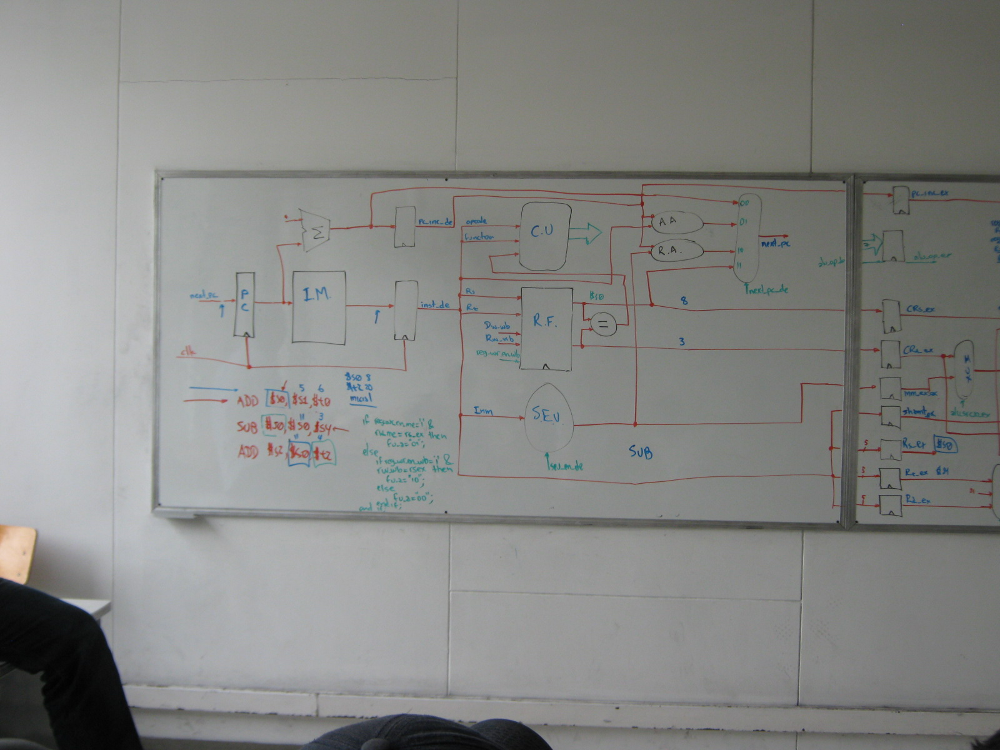
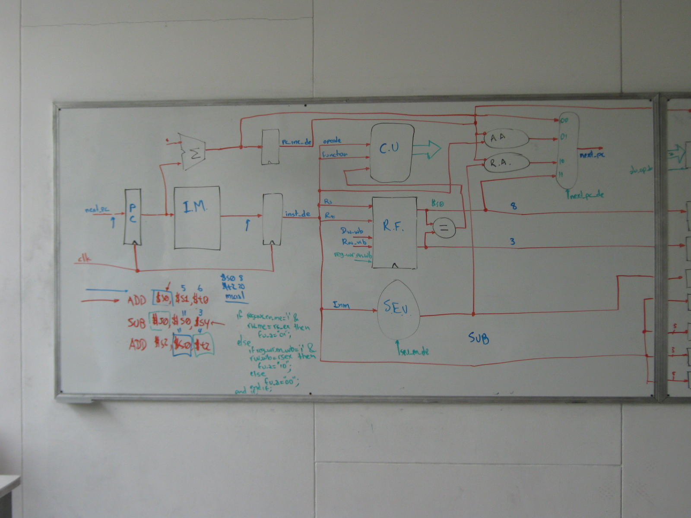
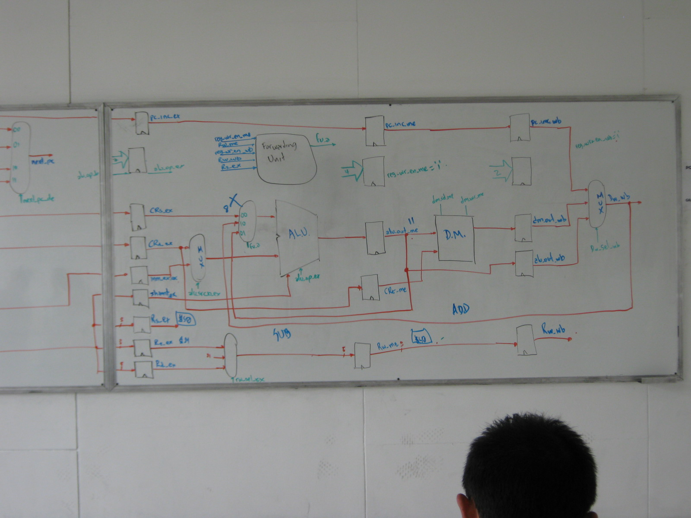
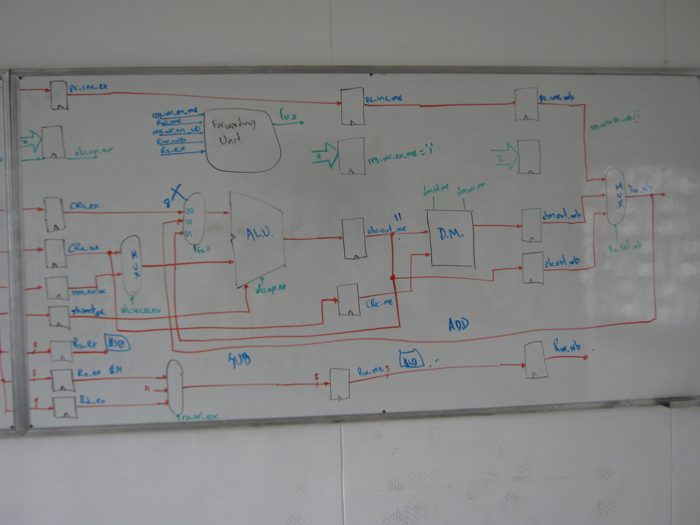
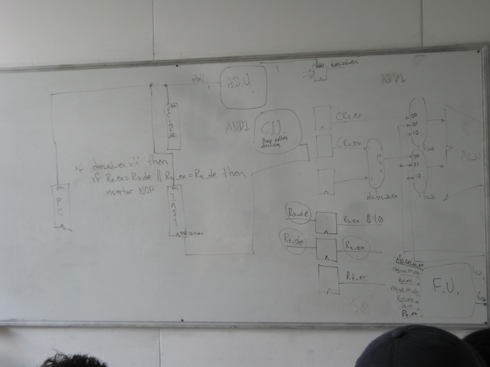

# Arquitectura de computadores - Proyectos y ejercicios en VHDL y Verilog

Todos mis ejercicios y ejemplos desarrollados durante mi pregrado en Ingeniería de Sistemas en la Universidad Tecnológica de Pereira (UTP)

Fotos del desarrollo del procesador segmentado:

